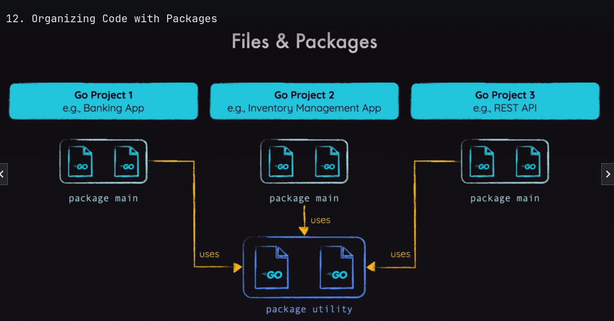

# Go essentials 

- go doesnt need semicolon to end a line (;)
- go REQUIRES double quotes (")

## Functions and values 

```go
    // a package is a way to group functions. It's made up of all the files within the same directory
    package main

    import "fmt"

    func main() {
        fmt.Print("hello world")
    }
    // strings are contained in double quotes or back ticks 
    // to run this file: go run . or go run file_name.go
```

## Organizing code with packages

 

```go
// we split code in multiple packages. one program must have at least one package
// a single package and be splitted into multiple file 
package main
https://pkg.go.dev/fmt@go1.23.3
import "fmt"

func main() {
    // ...
}

```

## The importance of the  package named 'main'

main is a special package that says that this is the entry point of the whole program

## running go:

> go run file_name.go

making a executable binary 

first we have to make it a module. a module consists of multiple packages, it's essentially a whole project 

> go mod init example.com/first-app 

after making it a module, a file name `go.mod` is made, consisting of the path name, go version and dependencies, think of the requirements.txt on python, or package.json on javascript 


> go build 

if the project doesnt have a main (`package main`), when running go build, the compiler would not know when the program should execute (it doesnt know the main entry point).

after building an executable, we have a file. run it using: `sudo ./first-app`


to add module requirements and sums for other 

> go mod tidy 

## The main() function 

- it must also be called main. 
- it will be executed first.
- one module must only have 1 main()
- most of the code must be functions.
- other libraries, such as fmt don't have a main, that's because *they are not meant to be executed, they are meant to provide utility functions to be imported and reused* 


## values and types


